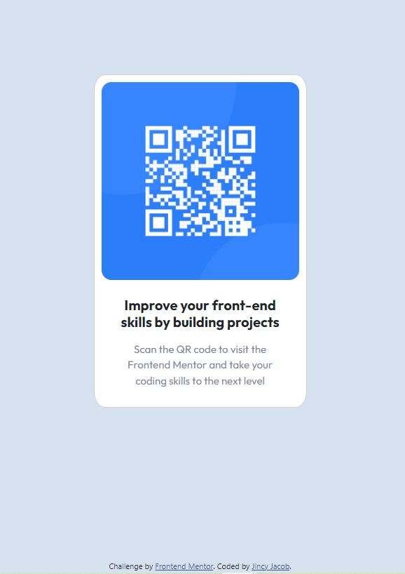

# Frontend Mentor - QR code component solution

This is a solution to the [QR code component challenge on Frontend Mentor](https://www.frontendmentor.io/challenges/qr-code-component-iux_sIO_H). Frontend Mentor challenges help you improve your coding skills by building realistic projects.

## Table of contents

- [Overview](#overview)
  - [Screenshot](#screenshot)
  - [Links](#links)
- [My process](#my-process)
  - [Built with](#built-with)
  - [What I learned](#what-i-learned)
  - [Continued development](#continued-development)
  - [Useful resources](#useful-resources)
- [Author](#author)
- [Acknowledgments](#acknowledgments)

## Overview

This is a practice project to improve UI design skills and more features will be added in future as I learn.

### Screenshot



### Links

- Solution URL: [Add solution URL here](https://your-solution-url.com)
- Live Site URL: [Add live site URL here](https://your-live-site-url.com)

## My process

### Built with

- Semantic HTML5 markup
- CSS custom properties
- Flexbox
- Bootstrap
- Mobile-first workflow

### What I learned

I learnt how to use Flexbox, CSS Grid and Bootstrap to do this project. Built 2 solutions one with Flexbox and 2nd with Bootstrap

```css
.container {
  display: flex;
  flex-direction: column;
  border-radius: 5%;
  height: 460px;
  text-align: center;
  max-width: 300px;
  background-color: white;
  padding: 10px;
}

.card {
  width: 19rem;
  padding: 10px;
  border-radius: 5%;
  font-family: "Outfit", sans-serif;
}
.card-text {
  color: hsl(220, 15%, 55%);
}
```

### Continued development

This is a practice project to improve UI design skills and more features will be added in future as I learn.

### Useful resources

- [Resource 1](https://getbootstrap.com/docs/5.0/getting-started/introduction/)
- [Resource 2](https://stackoverflow.com/questions/20451293/flexbox-centering-element-in-the-middle-of-the-screen) - This post helped me align my contents to the center

## Author

- Github - [jgeev](https://github.com/jgeev)
- Frontend Mentor - [@jgeev](https://www.frontendmentor.io/profile/jgeev)

## Acknowledgments

Thank you Frontend Mentor for the challenge.
